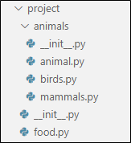

<p align="center">
<strong>
04. Wild Farm
</strong>
</p>

________________________________________________________

<p align="left">

Create the following project structure:


Your task is to create a class **hierarchy** like the one described below. The **Animal**, **Bird**, **Mammal**, and **Food** classes should be abstract:

In the **food.py** file, implement the following classes:
- **Food** - the class should be **abstract** and should receive **quantity** (int) upon **initialization**
- **Vegetable**, **Fruit**, **Meat** and **Seed** classes should **inherit** from the **Food** class

In the **animal.py** file, implement the following classes:
- **Animal** - the class should be **abstract** and should have the following attributes:
  - **name** (string) - passed upon **initialization**
  - **weight** (float) - passed upon **initialization**
  - **food_eaten** - 0 by default 
- **Bird** - should **inherit** from the **Animal** class. The class should be **abstract** and should have **wing_size** (float) as an additional attribute passed upon initialization.
- **Mammal** - should **inherit** from the **Animal** class. The class should be **abstract** and should have **living_region** (str) as an additional attribute passed upon initialization.

In the **birds.py** file, implement the following classes:
- **Owl**
- **Hen**

In the **mammals.py** file, implement the following classes:
- **Mouse**
- **Dog**
- **Cat**
- **Tiger**

All **animals** also can ask for food by producing a sound. Create a **make_sound()** method that returns the sound:
- **Owl** - **"Hoot Hoot"**
- **Hen** - **"Cluck"**
- **Mouse** - **"Squeak"**
- **Dog** - **"Woof!"**
- **Cat** - **"Meow"**
- **Tiger** - **"ROAR!!!"**

Now use the classes that you have created to instantiate some animals and feed them. Add method **feed**(**food**) where the food will be an instance of some food classes.

**Animals** will only eat a specific type of food, as follows:
- Hens eat **everything**
- Mice eat **vegetables** and **fruits**
- Cats eat **vegetables** and **meat**
- Tigers, Dogs, and Owls eat only **meat**

If you try to give an animal a **different type** of food, it will not eat it, and you should return:
- **"{AnimalType} does not eat {FoodType}!"**

The weight of an animal will increase with every piece of food it eats, as follows:
- Hen - **0.35**
- Owl - **0.25**
- Mouse - **0.10**
- Cat - **0.30**
- Dog - **0.40**
- Tiger - **1.00**

Override the **__repr__()** method to print the information about an animal in the formats:
- Birds - **"{AnimalType} [{AnimalName}, {WingSize}, {AnimalWeight}, {FoodEaten}]"**
- Mammals - **"{AnimalType} [{AnimalName}, {AnimalWeight}, {AnimalLivingRegion}, {FoodEaten}]"**

***Note: Submit all your classes and your imports in the judge system***

</p>

_____________________________________________________________

<h4 align="center">Test Code 1</h4>

```Python
owl = Owl("Pip", 10, 10)
print(owl)
meat = Meat(4)
print(owl.make_sound())
owl.feed(meat)
veg = Vegetable(1)
print(owl.feed(veg))
print(owl)

```

<h4 align="center">Output 1</h4>

```
Owl [Pip, 10, 10, 0]
Hoot Hoot
Owl does not eat Vegetable!
Owl [Pip, 10, 11.0, 4]
```

<h4 align="center">Test Code 2</h4>

```Python
hen = Hen("Harry", 10, 10)
veg = Vegetable(3)
fruit = Fruit(5)
meat = Meat(1)
print(hen)
print(hen.make_sound())
hen.feed(veg)
hen.feed(fruit)
hen.feed(meat)
print(hen)

```

<h4 align="center">Output 2</h4>

```
Hen [Harry, 10, 10, 0]
Cluck
Hen [Harry, 10, 13.15, 9]
```
